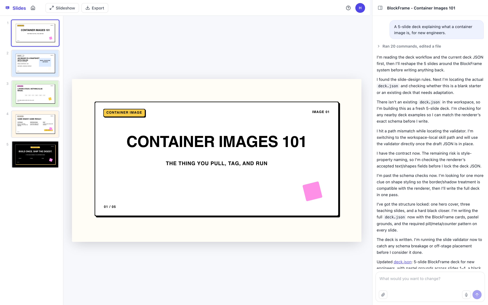
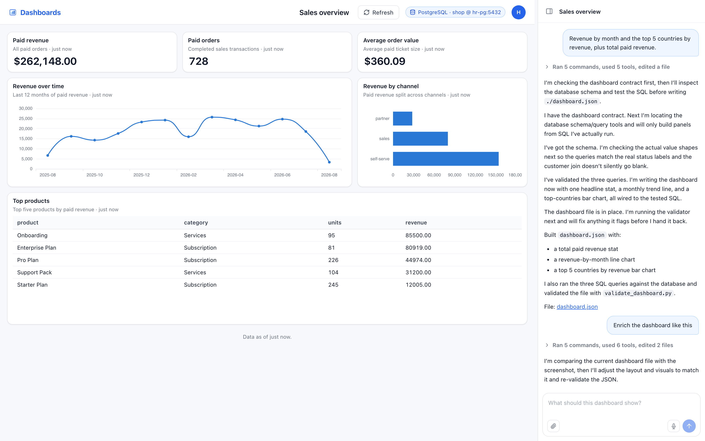
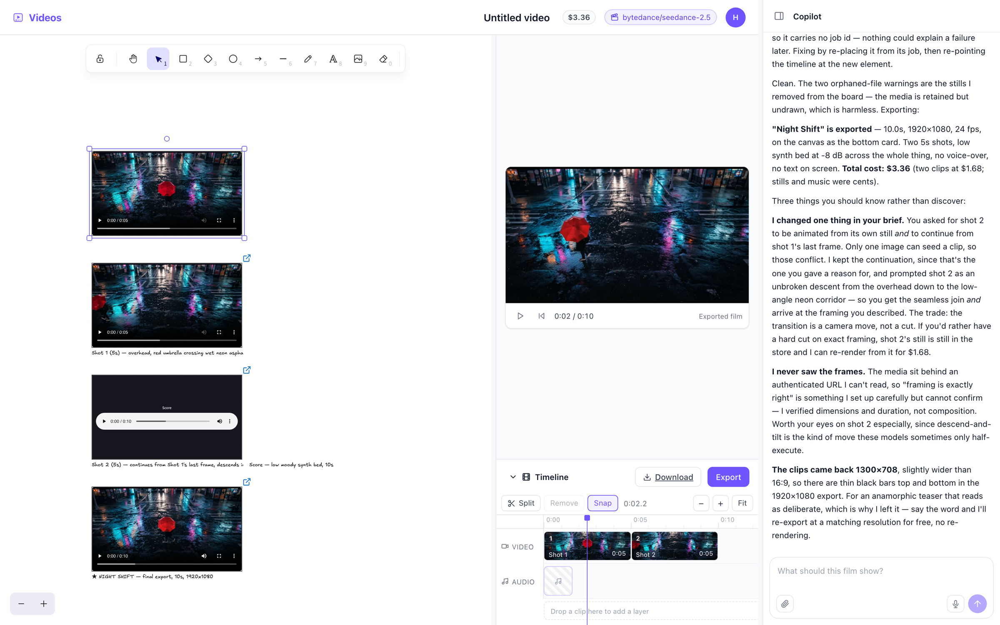
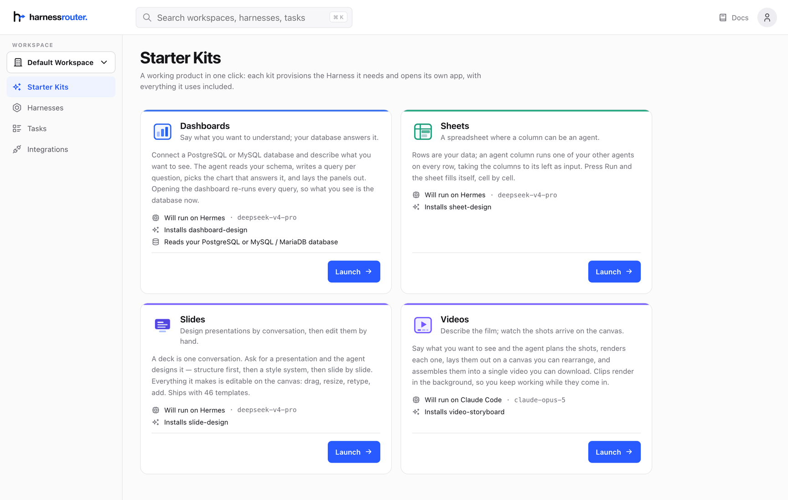

<div align="center">
  <a href="https://harnessrouter.ai">
    <picture>
      <source media="(prefers-color-scheme: dark)" srcset=".github/images/logo-dark.png">
      <source media="(prefers-color-scheme: light)" srcset=".github/images/logo-light.png">
      
    </picture>
  </a>
</div>

<div align="center">
  <h3>Starter demos and production kits for HarnessRouter.</h3>
</div>

<div align="center">

[](./LICENSE)
[](https://github.com/HarnessRouter/harnessrouter)
[](https://discord.gg/nPcbwqVPb2)
[](https://x.com/HARNESSROUTER)

</div>

<br>

Starter demos and production-ready kits for [HarnessRouter](https://harnessrouter.ai), the unified API for running agent harnesses such as Codex and Claude Code as your product backend.

An LLM returns tokens. A harness gives it a sandbox, tools, and a loop, so it returns the actual file. HarnessRouter lets your app send a task through one API and get back finished work.

This repository holds two kinds of thing. **Kits** (`kits/`) are whole products you can launch and
use today — Slides, Sheets, Dashboards and Videos — each a foundation to build your own on.
**Demos** (`demos/`) are small MIT-licensed apps that show the integration patterns in code you can
read in an afternoon.

## Get your API key

1. [Create a HarnessRouter account](https://app.harnessrouter.ai/login?ref=github-starter). Signing up is free.
2. Add a payment card to unlock the 500 free launch credits (limited-time offer).
3. Follow the [quickstart](https://app.harnessrouter.ai/quickstart?ref=github-starter) to create an API key, and — for the coding demo — an agent whose ID you will reference below.

**The kits need none of this.** They are launched from the console and served by it, so they have
no API key to configure; you only need a key for the demos, which run as their own apps against
the API. Credits are consumed when work actually runs, and everything here fits comfortably
inside the free ones.

## The kits

Four working products, each launched from **Starter Kits** in the HarnessRouter console. Launching
one provisions the Harness it needs and serves the app from the HarnessRouter image — there is no
separate service to deploy, no database to configure, and no API key to paste into the app.

Every one of them is the same idea in a different shape: **a session is a document**. The list of
decks, sheets, dashboards or films *is* the Harness's session list, and the document is a file in
that session's workspace. Delete the session and the work goes with it.

<br>

### Slides — design a deck by talking about it

Ask for a presentation and the agent works the way a designer does: structure first, then a style
system, then slide by slide. Everything it makes is an object on the canvas you can drag, retype
and restyle — it hands you a deck, not a picture of one.



**[Open the Slides kit →](./kits/slides)**

<br>

### Sheets — a column that is an agent

Rows are your data. An **agent column** runs one of your other agents once per row, builds its
input from the columns to its left, and fills each cell with what that agent said and made. Two
hundred rows is two hundred runs you did not have to orchestrate.


**[Open the Sheets kit →](./kits/sheets)**

<br>

### Dashboards — ask your database a question

Say what you want to understand. The agent reads your schema, decides which charts answer it,
writes the SQL for each and lays them out. Opening the dashboard re-runs every query, so the
numbers are today's. It connects with a **SELECT-only** account and every statement is checked
before it runs.



**[Open the Dashboards kit →](./kits/dashboard)**

<br>

### Videos — describe the film, watch the shots arrive

The agent plans the shots, writes a prompt for each, renders them, and lays them on a canvas while
they land. Cut them on a real timeline — trim, split, layers, a music bed, a voice-over — and
export one file. Shots can be seeded from a still or continue from the frame the last one ended
on, which is how two clips join without a jump.



**[Open the Videos kit →](./kits/video)**

<br>

They are launched from one page in the console:



## Licensing at a glance

The kits under `kits/` are **not** MIT — they carry the
[HarnessRouter Starter Kit License Agreement](./kits/LICENSE.md). Individual local use is free;
so is internal use for up to three people, or any size on HarnessRouter Cloud. Selling or hosting
one for an external customer needs the
[Commercial Use and Deployment Agreement](./kits/COMMERCIAL-DEPLOYMENT-AGREEMENT.md). The full
terms are [below](#licensing).

## Demos

Smaller, MIT-licensed, and meant to be read: these show the HarnessRouter integration patterns —
streaming, sessions, follow-up turns, cancellation, file download — in as little code as possible.

### 1. Cursor-style coding app

A coding-agent interface that demonstrates project-aware tasks, streamed output, persistent sessions, follow-up work, cancellation, and generated-file downloads. Watch the [55-second build video](https://harnessrouter.ai/example?ref=github-starter) to see it running.

[Open the Cursor-style demo guide](./demos/01-cursor-coding-app/README.md)

```bash
npm install
cp .env.example .env
# Add HR_API_KEY and HR_CURSOR_AGENT_ID to .env
npm run dev:cursor
```

Then open [http://localhost:3000](http://localhost:3000).

### 2. LumaCare

A family-care companion that uses the same secure streaming and session architecture in a healthcare-support experience.

[Open the LumaCare demo guide](./demos/02-lumacare/README.md)

```bash
# Add HR_API_KEY to .env; LumaCare's agent mapping is checked in
npm run dev:lumacare
```

Then open [http://localhost:3000](http://localhost:3000).

Run one demo at a time because both use port `3000` by default.

## Repository structure

```text
.
├── demos/
│   ├── 01-cursor-coding-app/  # Primary demo
│   └── 02-lumacare/           # Secondary reference demo
├── kits/                      # Separately licensed production kits (see kits/LICENSE.md)
│   ├── slides/                # Design a deck by conversation
│   ├── sheets/                # A spreadsheet where a column is an agent
│   ├── dashboard/             # Ask your database a question
│   └── video/                 # Describe the film, watch the shots arrive
├── .env.example               # Shared local configuration template
├── package.json               # npm workspace commands
└── README.md                  # Repository and demo index
```

Each demo owns its frontend, server, tests, agent mapping, and documentation. This keeps the two products independent while making their shared HarnessRouter architecture easy to compare.

## Prerequisites

- Node.js 22 or newer
- A HarnessRouter API key (see [Get your API key](#get-your-api-key))
- A HarnessRouter coding-agent ID for the primary demo

## Commands

```bash
npm run dev:cursor   # Run the primary coding demo
npm run dev:lumacare # Run the secondary LumaCare demo
npm test             # Test both workspaces
npm run build        # Build and type-check both workspaces
```

Credentials belong in an ignored `.env` file and never in source control. See each demo's README for its configuration and architecture.

## Resources

- **[HarnessRouter](https://github.com/HarnessRouter/harnessrouter)** — the open-source engine these demos and kits run on.
- **[Documentation and Cloud](https://harnessrouter.ai)** — hosted service, guides, and pricing.
- **[Unified Harness Protocol](https://unifiedharnessprotocol.org)** — the open standard behind it.
- **[Discord](https://discord.gg/nPcbwqVPb2)** — community for questions and integrations.

## Licensing

This is a mixed-license repository:

- Files without a more specific directory license, including the reference demos, are available under the [repository MIT License](./LICENSE).
- Everything under `kits/` is governed by the [HarnessRouter Starter Kit License Agreement](./kits/LICENSE.md), not MIT. This covers all current and future contents of `kits/`, including any kit added later.
- Individual local use is free, including learning, evaluation, personal projects, and the individual's own business operations.
- Organizations using HarnessRouter Cloud for Internal Use do not pay a separate Kit license fee or have a Direct User limit; Cloud plan and usage charges still apply.
- Non-Cloud Internal Use is free for up to three Direct Users. A paid entitlement is required before a fourth Direct User begins use or for separately metered automation.
- **Creating paid Client Deliverables or selling, deploying, hosting, or providing an End Product to an external customer requires the [Commercial Use and Deployment Agreement](./kits/COMMERCIAL-DEPLOYMENT-AGREEMENT.md) and an applicable Order Form.**
- Sharing materials about your own business with investors, customers, advisers, and other counterparties is not Commercial Use merely because an external person receives them.
- Generated presentations and exported files remain usable subject to the applicable Internal or Commercial Use rights.
- Third-party components remain governed by their own licenses and notices.

The license included with a particular copy controls that copy. The current license structure does not revoke rights validly granted for an earlier copy under the license distributed with that earlier copy.

## Learn more

- [HarnessRouter website](https://harnessrouter.ai?ref=github-starter)
- [Documentation](https://harnessrouter.ai/docs?ref=github-starter)
- [Pricing](https://harnessrouter.ai/pricing?ref=github-starter)
