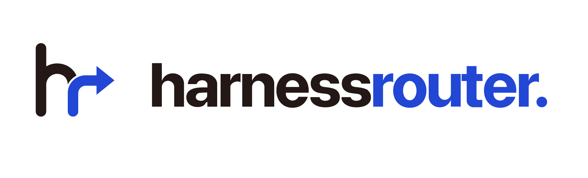

<div align="center">
  <a href="https://harnessrouter.ai">
    <picture>
      <source media="(prefers-color-scheme: dark)" srcset=".github/images/logo-dark.png">
      <source media="(prefers-color-scheme: light)" srcset=".github/images/logo-light.png">
      
    </picture>
  </a>
</div>

<div align="center">
  <h3>Starter demos and production kits for HarnessRouter.</h3>
</div>

<div align="center">

[](./LICENSE)
[](https://github.com/HarnessRouter/harnessrouter)
[](https://discord.gg/nPcbwqVPb2)
[](https://x.com/HARNESSROUTER)

</div>

<br>

Starter demos and production-ready kits for [HarnessRouter](https://harnessrouter.ai), the unified API for running agent harnesses such as Codex and Claude Code as your product backend.

An LLM returns tokens. A harness gives it a sandbox, tools, and a loop, so it returns the actual file. HarnessRouter lets your app send a task through one API and get back finished work.

This repository contains two MIT-licensed reference demos and a set of separately licensed production kits. The **Cursor-style coding app is the primary demo**; **LumaCare is a second reference demo** showing how the same HarnessRouter patterns transfer to a different domain. The production kits live under `kits/`, each a heavier product foundation with its own license terms.

## Get your API key

1. [Create a HarnessRouter account](https://app.harnessrouter.ai/login?ref=github-starter). Signing up is free.
2. Add a payment card to unlock the 500 free launch credits (limited-time offer).
3. Follow the [quickstart](https://app.harnessrouter.ai/quickstart?ref=github-starter) to create an API key, and for the primary demo, a coding agent whose agent ID you will reference below.

You can install and start either demo without a card. Credits are only consumed once the app sends tasks through your API key, and both demos run comfortably within the free credits.

## Demos

### 1. Cursor-style coding app — primary demo

A coding-agent interface that demonstrates project-aware tasks, streamed output, persistent sessions, follow-up work, cancellation, and generated-file downloads. Watch the [55-second build video](https://harnessrouter.ai/example?ref=github-starter) to see it running.

[Open the Cursor-style demo guide](./demos/01-cursor-coding-app/README.md)

```bash
npm install
cp .env.example .env
# Add HR_API_KEY and HR_CURSOR_AGENT_ID to .env
npm run dev:cursor
```

Then open [http://localhost:3000](http://localhost:3000).

### 2. LumaCare — secondary reference demo

A family-care companion that uses the same secure streaming and session architecture in a healthcare-support experience.

[Open the LumaCare demo guide](./demos/02-lumacare/README.md)

```bash
# Add HR_API_KEY to .env; LumaCare's agent mapping is checked in
npm run dev:lumacare
```

Then open [http://localhost:3000](http://localhost:3000).

Run one demo at a time because both use port `3000` by default.

## Production kits

Production kits live under `kits/`. Each one is a production-ready application foundation with its own guide (see the kit's own `README.md`) and its own license terms. Launch any kit from **Starter Kits** in the HarnessRouter console, which provisions the Harness and serves the app from the HarnessRouter image.

For example, the Slides kit provides a presentation application foundation with an editable canvas, a conversational copilot, templates, a slide-design Skill, and deck validation: [open the Slides kit guide](./kits/slides/README.md).

Anything added under `kits/` later is covered by the same licensing described below, with no change to this repository's terms.

## Repository structure

```text
.
├── demos/
│   ├── 01-cursor-coding-app/  # Primary demo
│   └── 02-lumacare/           # Secondary reference demo
├── kits/                      # Separately licensed production kits (see kits/LICENSE.md)
├── .env.example               # Shared local configuration template
├── package.json               # npm workspace commands
└── README.md                  # Repository and demo index
```

Each demo owns its frontend, server, tests, agent mapping, and documentation. This keeps the two products independent while making their shared HarnessRouter architecture easy to compare.

## Prerequisites

- Node.js 22 or newer
- A HarnessRouter API key (see [Get your API key](#get-your-api-key))
- A HarnessRouter coding-agent ID for the primary demo

## Commands

```bash
npm run dev:cursor   # Run the primary coding demo
npm run dev:lumacare # Run the secondary LumaCare demo
npm test             # Test both workspaces
npm run build        # Build and type-check both workspaces
```

Credentials belong in an ignored `.env` file and never in source control. See each demo's README for its configuration and architecture.

## Resources

- **[HarnessRouter](https://github.com/HarnessRouter/harnessrouter)** — the open-source engine these demos and kits run on.
- **[Documentation and Cloud](https://harnessrouter.ai)** — hosted service, guides, and pricing.
- **[Unified Harness Protocol](https://unifiedharnessprotocol.org)** — the open standard behind it.
- **[Discord](https://discord.gg/nPcbwqVPb2)** — community for questions and integrations.

## Licensing

This is a mixed-license repository:

- Files without a more specific directory license, including the reference demos, are available under the [repository MIT License](./LICENSE).
- Everything under `kits/` is governed by the [HarnessRouter Starter Kit License Agreement](./kits/LICENSE.md), not MIT. This covers all current and future contents of `kits/`, including any kit added later.
- Individual local use is free, including learning, evaluation, personal projects, and the individual's own business operations.
- Organizations using HarnessRouter Cloud for Internal Use do not pay a separate Kit license fee or have a Direct User limit; Cloud plan and usage charges still apply.
- Non-Cloud Internal Use is free for up to three Direct Users. A paid entitlement is required before a fourth Direct User begins use or for separately metered automation.
- **Creating paid Client Deliverables or selling, deploying, hosting, or providing an End Product to an external customer requires the [Commercial Use and Deployment Agreement](./kits/COMMERCIAL-DEPLOYMENT-AGREEMENT.md) and an applicable Order Form.**
- Sharing materials about your own business with investors, customers, advisers, and other counterparties is not Commercial Use merely because an external person receives them.
- Generated presentations and exported files remain usable subject to the applicable Internal or Commercial Use rights.
- Third-party components remain governed by their own licenses and notices.

The license included with a particular copy controls that copy. The current license structure does not revoke rights validly granted for an earlier copy under the license distributed with that earlier copy.

## Learn more

- [HarnessRouter website](https://harnessrouter.ai?ref=github-starter)
- [Documentation](https://harnessrouter.ai/docs?ref=github-starter)
- [Pricing](https://harnessrouter.ai/pricing?ref=github-starter)
