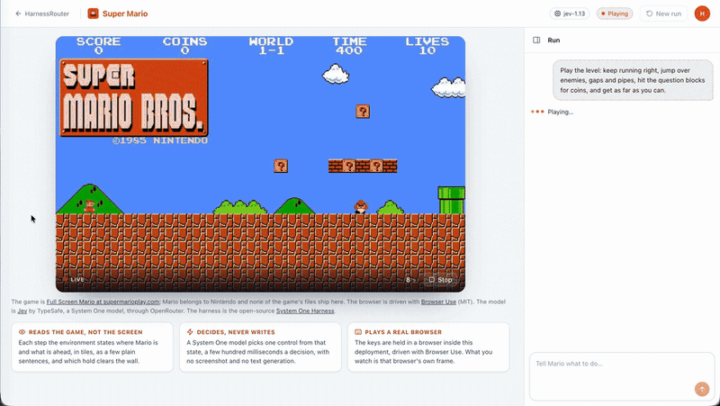

<h1 align="center">Super Mario</h1>

<p align="center"><strong>A System One model plays a live platform game, several decisions a second, and you watch the browser it plays in.</strong></p>

<p align="center">
  
  <br>
  <sub>Jev plays through typed decisions while the kit streams its browser. The game is <a href="https://supermarioplay.com/game/mario.html?v=1.0.1">Full Screen Mario</a>. Mario and its characters belong to Nintendo. No game files ship with this repository.</sub>
</p>

<p align="center">
  <a href="https://github.com/HarnessRouter/SystemOneHarness" title="System One Harness on GitHub"></a>
  <br>
  <sub>Runs on the open-source <a href="https://github.com/HarnessRouter/SystemOneHarness">System One Harness</a>, the harness for System One models. One model call per step. No generated actions. A probability on every transition.</sub>
</p>

> [!TIP]
> **Start here:** [Launch it](#launch-it) · [What you see](#what-you-see) · [How a step works](#how-a-step-works) · [The actions](#the-actions) · [Measured, not tuned](#measured-not-tuned) · [Develop the page](#develop-the-page)

The model never sees a pixel and never writes text. Each step the environment reads the game's own state and says it as a few literal sentences: where Mario is, whether he is on the ground, what is ahead and how far, in tiles. The model chooses one control to hold. The keys stay held until the next decision. That is the whole loop, a few hundred milliseconds a turn.

## Launch it

Open **Starter Kits** in the HarnessRouter console and launch Super Mario. That provisions the Harness this kit needs, a fork of the System One base carrying this kit's instructions and its plugin, and serves the page from the HarnessRouter image at `/kits/mario`. Nothing else is deployed, and no key is pasted into the page: the model is reached through your HarnessRouter connections.


What it needs:

- **HarnessRouter 0.21.0 or newer.** That is the release the `systemone` base arrived in.
- **An OpenRouter connection.** The model is [Jev](https://typesafe.ai) by TypeSafe, a System One model, and OpenRouter is where the kit reaches it (`jev-1.13`, or `jev-latest` for the rolling alias).
- **A minute on a fresh install.** The first launch adds a Chromium beside the System One base. Later launches are immediate.

Then press **Play**. Play starts a run with the default goal; the composer under the run takes any other goal, and **New run** starts over in a new session.

## What you see

The page has the shape of the other kits: a stage on the left and the run's conversation on the right.

- **The stage is the model's browser.** The environment turns on the browser's own screencast and writes every third frame the game draws, about twenty a second at 7 KB each, to `frame.jpg` in the session's workspace. The page reads that file through the session's live workspace, shows a frame once it has decoded, and drops any that arrives after a newer one. The frame rate on the stage is the rate of frames it actually displayed. Score, coins, world, time and lives are the game's own.
- **The run is the conversation.** Every decision appears as the model makes it, with the game's reply beneath it, in the same chat column the other kits mount. Open one and you read exactly what the model read.
- **The cards under the stage** say what is different about this kit: it reads the game, not the screen; it decides and never writes; it plays a real browser.

## How a step works

The harness runs the same loop for every environment. The kit's plugin is the environment.

```text
            ┌──────────────────────────────────────────────────────────┐
            │                        controller                        │
 goal ────► │ observe ─► compile ─► encode ─► decide ─► gate ─► execute │ ────► trace
            │    ▲                                           │         │
            │    └────────────── environment ◄───────────────┘         │
            └──────────────────────────────────────────────────────────┘
```

1. **Observe.** The environment reports the game's state as text, with the terminal state when the level is cleared or the lives are gone.
2. **Compile.** The controls become one typed question; `finish` and `escalate` are among its answers.
3. **Encode.** Goal, observation and a short history become the state the model reads.
4. **Decide.** The model answers the action and the goal check in one request, with a probability on each.
5. **Gate.** The answer must clear the action's risk threshold. A held key changes nothing outside the game, so the controls are read-risk: gated as writes, the model was refused three times mid-air and the run stopped.
6. **Execute.** The environment sets the keys and returns the next state.

`finish` and `escalate` are actions of their own, never prose. The run ends as completed, incomplete, failed or cancelled with a reason, and the trace holds every step.

This is one real step from a run on 2026-09-20. The game's reply to the last action is the state; the model's answer is the next line.

```text
walk_left: holding left. Mario is on the ground at x 13 tiles of a 30 tile screen, moving right.
Nearest enemy: Goomba 5.2 tiles ahead, at Mario's height, walking toward Mario, at Mario in about
10 decisions if he stands still. No gap in the ground within 14 tiles. No pipe or wall within
8 tiles. Blocks overhead 2 tiles ahead: a running jump there hits them and drops Mario straight
down. Until the next decision Mario covers about 3.5 tiles, and a walking enemy closes about 4.1.
Within one step: the Goomba 5.2 tiles ahead. Now: jump_right now over the enemy: the last chance.
Lives 10, coins 0, time 396, score 0.

→ jump_right
```

Two steps later Mario is in the air, the Goomba is 0.3 tiles ahead, and the state's closing line says to keep the jump held so it goes again the moment he lands. Every number in that text comes from the game. Nothing in it is an estimate.

## The actions

The plugin is an MCP server, `bin/mario-env`. Two of its tools are the protocol; the other five are the keys the game listens to.

| Tool | What it does |
|---|---|
| `observe` | Where Mario is and what is ahead, right now. |
| `reset` | Reload the game for a new run. |
| `run_right` | Hold right and run. Mario runs right, or keeps running, until the keys change. |
| `jump_right` | Hold right, run and jump. Mario leaves the ground if he is on it, and the longer the jump stays held the higher he goes. |
| `jump` | Hold jump alone: a jump straight up, standing. |
| `walk_left` | Hold left: Mario walks left, to back away from something. |
| `wait` | Let go of every key: Mario stops, and a held jump is released. |

An action sets the keys and returns. The keys stay set until the next action, and the model chooses every step. Two things about the keys are the input layer's, the way a thumb plays:

- **A jump means a press.** `jump_right` or `jump` on the ground with the jump key still held from the last jump lets it go and presses it again. The game wants the release.
- **A jump held in the air goes again on landing.** `jump_right` chosen while Mario is in the air keeps the key down and presses it the moment he lands, so hops chain the way they do under a held button. Any later action cancels it. Recorded nine times in a row before this rule: the jump over the fourth pipe came down a tile before the first gap, and no decision could arrive in time.

## Measured, not tuned

The state is literal and every number in it is the game's: where Mario is and whether he is on the ground; the ground ahead as a profile, the next gap, the next drop and what follows it, the next step or wall and its height; the nearest enemy ahead and whether it walks toward him, and the nearest behind; the block rows overhead and the next question block; how far one decision carries him at the loop's own measured pace; and a closing line beginning "Now:" that says what the measured facts call for at this moment.

The facts the "Now:" line and the kit's instructions carry were measured on the live game, each from a recording, a copy of every frame the page showed cut into a contact sheet around a death, read, then measured with a probe before the environment changed:

- A running jump started 1.5 to 4 tiles before the first Goomba survives; 5 to 9 tiles hits the block row and drops onto it. When that window cannot be hit at the loop's pace, the stop and the standing jump, 1 to 2.5 tiles, take over: eight of eight.
- A 4-tile pipe is cleared only at a full run with the jump held long, taken 2 to 3 tiles before it.
- A gap or a drop is left from its edge. A one-tile step is a hop; a stair is a hop per step.
- The ground is read from Mario's level rather than his feet, so the floor is still there when he is below its top. Read from his feet it vanished, and three lives went to a "gap 12 tiles wide".
- The nearest thing ahead decides. A gap five tiles on once outranked the one-tile step he was pressed against, for 284 decisions, until the clock ran out.

The environment's test bench is a player that obeys the state's own "Now:" line with a model-like delay of 0.2 s, apart from any model. On the level's current environment it clears 1-1 in 50 game seconds with one death (2026-09-20). The model's own runs are recorded the same way.

## How it is put together

- **The harness** is a fork of the `systemone` base with this kit's instructions and one plugin. The base is general and knows nothing about the game; everything about the game lives in the plugin, which is what a fork of a base is for. The base declares no built-in tools and takes no skills: its actions are the environment's.
- **The plugin** (`plugin/`) is the environment: an MCP server that opens the game in a headless Chromium inside the deployment, driven with [Browser Use](https://github.com/browser-use/browser-use) over the Chrome DevTools Protocol, reads the game's state each step and holds the keys.
- **The page** (`app/`) streams the browser and mounts the run.

| Path | What |
|---|---|
| `kit.json` | The Harness this kit needs, its instructions with the measured facts, and where its app is served |
| `plugin/plugin.json` | The plugin's name and version, in the [Agent Plugins](https://agent-plugins.org) format |
| `plugin/mcp.json` | The one MCP server the plugin ships |
| `plugin/bin/mario-env` | The environment's executable |
| `plugin/server/mario_env.py` | The environment: the game's state as sentences, the keys as actions, the frame for the page |
| `app/` | The page |

**Launching again after an update.** A launch captures the kit's package onto the harness. A kit updated afterwards, by a new image, leaves the harness on the old package until something launches it again, so the page compares the package version it was built with against the harness and relaunches it in place when they differ.

## Develop the page

```sh
cd kits/mario/app
npm install
npm run dev        # against a console at the same origin, or set a proxy for /api and /kits
npm run build      # what the image serves at /kits/mario
```

### The package's configuration, objective and evidence

`plugin/config.yaml` is the reflex's configuration, versioned with the package: the instructions,
the gate, the encoder, the tunables the rendering reads (the enemy and gap horizons, the tall-wall
height, the measured take-off windows) and the objective (pass on `cleared`, a failure per life
lost, `level_x` as the locus, `observations/` as the evidence). The environment archives every
frame it shows under `observations/` beside the live `frame.jpg`, and `plugin/tools/evidence.py`
cuts that archive into a contact sheet around each failure. `plugin/ledger.jsonl` records every
version with its evidence and verdict. An outer harness (the `plugins/calibrate` package in this
repository) reads all of it to improve the configuration one version at a time; the design is
`docs/dual-loop.md` in the System One Harness repository.

## Credits

- The game is **Full Screen Mario**, played at [supermarioplay.com](https://supermarioplay.com/game/mario.html?v=1.0.1). Mario and its characters belong to Nintendo; this kit plays the page as a person would and ships none of the game's files.
- The browser is driven with [Browser Use](https://github.com/browser-use/browser-use) (MIT) over the Chrome DevTools Protocol.
- The model is [Jev](https://typesafe.ai) by TypeSafe, a System One model, reached through OpenRouter.
- The harness is the [System One Harness](https://github.com/HarnessRouter/SystemOneHarness) (Apache-2.0).

<a href="https://github.com/HarnessRouter/SystemOneHarness" title="Star System One Harness on GitHub">
  <picture>
    <source media="(max-width: 600px)" srcset="https://raw.githubusercontent.com/HarnessRouter/SystemOneHarness/main/.github/images/github-readme-star-cta-mobile.svg">
    
  </picture>
</a>

## License

Super Mario is a separately licensed production kit and is not covered by the repository's MIT License. See the [HarnessRouter Starter Kit License Agreement](../LICENSE.md).
