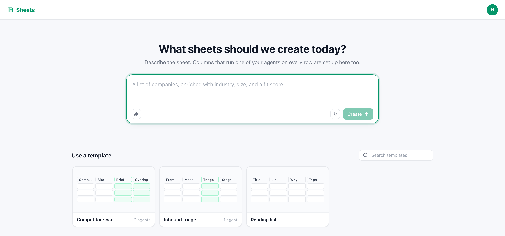

# Sheets

A spreadsheet where a column can be an agent. Rows are your data; an **agent column** runs one of
your other agents once per row, builds its input from the columns to its left, and fills each cell
with what that agent said and made.

Launch it from **Starter Kits** in the HarnessRouter console. That provisions the Harness this app
talks to; nothing else is deployed and nothing is configured.

## The first screen

Launch it and this is the first screen: describe the sheet you want, or start from one of the
templates.



The idea worth understanding is the **agent column**. A normal column holds values. An agent
column holds a *job*: for every row, it builds a prompt from the cells to its left, runs one of
your other agents, and writes back what that agent said — plus any file it produced, attached to
the cell. Add a row and the job runs for that row. It is a spreadsheet where fill-down is an
agent doing real work, one row at a time, and you can watch each cell arrive.

## How it works

- **One session is one sheet.** The sheet list is this Harness's session list, and a sheet's
  content is `sheet.json` in that session's workspace. There is no database.
- **The app is served by the HarnessRouter image** at `/kits/sheets`, same-origin with the
  console, which is why it needs no API key and no login of its own.
- **Column order is execution order.** An agent column may only read columns earlier in the sheet,
  which makes the column list a valid running order by construction — there is no graph to sort
  and no cycle to handle.
- **The run happens in your browser tab.** There is no workflow engine in this deployment, so the
  page is the orchestrator: it walks the cells in dependency order with a concurrency limit you
  choose. Cells already started finish if you leave; nothing new starts, and the page says so
  before you press Run.
- **Each cell is its own conversation.** One session per cell, titled for its column and row, so
  every result is a real conversation you can open in the console and read.
- **Only the last run is kept.** Starting a run clears the cells it owns. The conversations are
  never deleted — you drop the reference, not the work.
- **Files you attach in the copilot go straight into the turn**, not into a separate upload step,
  so "read the CSV I just gave you" works even on the first message of a sheet that has no session
  yet. The same mechanism hands an agent column's output file to the column after it.
- **Dictation is the browser's own recogniser.** No speech service is involved, and the button is
  absent rather than disabled where the browser has none.

## What's in the folder

| Path | What |
|---|---|
| `kit.json` | The Harness this kit needs, and where its app is served |
| `skills/sheet-design/` | The `sheet.json` contract and how to design columns — read before anything is written |
| `templates/templates.json` | Starting points, including one with agent columns |
| `app/` | The UI |

## Working on the app

```
cd app
npm install
npm test          # the document rules and the run planner, no network needed
npm run build
```

`src/lib` is deliberately free of React and of the network:

| File | What |
|---|---|
| `model.js` | The document: ids, references, interpolation, and every way a sheet can be wrong |
| `run.js` | `plan()` and the `Runner` — what would run, and the walk, over an injected dispatcher |
| `cell.js` | The dispatcher: one cell, one turn |
| `sh.js` | What "sheet" adds on top of `reifyui/harness` |

`model.test.mjs` and `run.test.mjs` cover both. `skills/sheet-design/validate_sheet.py` is the
agent-side twin of `model.js`'s `validate()`; if the two ever disagree, the app is right.

## License

This kit is governed by the [HarnessRouter Starter Kit License Agreement](../LICENSE.md), not MIT.

- Individual local use is free under that Agreement.
- Selling, deploying, hosting or providing an End Product to an external customer, and creating
  paid Client Deliverables, require the
  [Commercial Use and Deployment Agreement](../COMMERCIAL-DEPLOYMENT-AGREEMENT.md) and an
  [Order Form](../ORDER-FORM-TEMPLATE.md).

Third-party materials keep their own licenses — see [CREDITS.md](./CREDITS.md).
