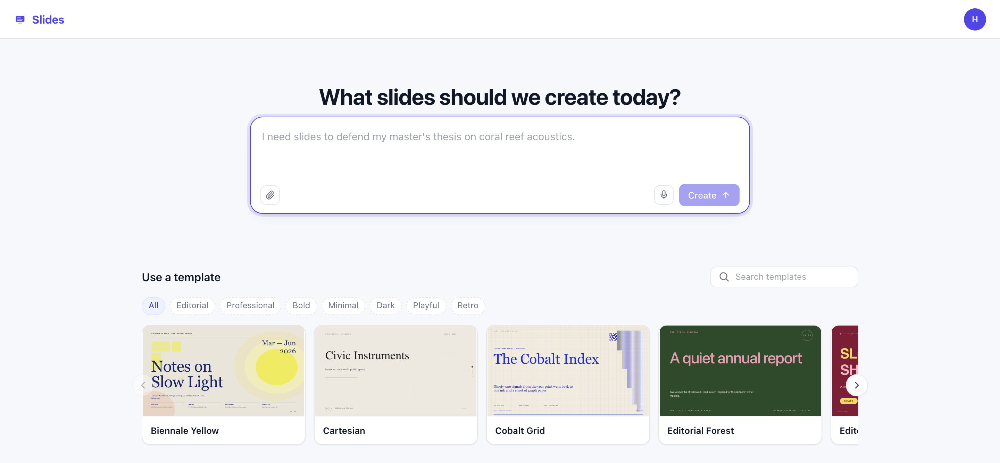

# Slides

A deck is a conversation. Ask for a presentation and the agent designs it — structure first, then
a style system, then slide by slide — and everything it makes is yours to edit.

Launch it from **Starter Kits** in the HarnessRouter console. That provisions the Harness this app
talks to; nothing else is deployed and nothing is configured.

## The first screen

Launch it and this is the first screen: one box, and a shelf of templates if you would rather
start from a look than from a blank page. A template is a **style system** — type scale, palette,
layout rules — not a fixed set of slides, so asking for eleven slides in a five-slide template
gets you eleven slides that match.

What comes back is a deck of real objects — text frames, shapes, images, tables — each one
selectable, editable and restylable. The agent is a very good first draft, not a rendering
service: nothing it makes is a flat picture you have to ask it to change.

## How it works

- **One session is one deck.** The deck list is this Harness's session list, and a deck's content
  is `deck.json` in that session's workspace. There is no database.
- **The app is served by the HarnessRouter image** at `/kits/slides`, same-origin with the
  console, which is why it needs no API key and no login of its own.
- **The deck is JSON on a fixed 1920×1080 stage.** Every slide and element carries a stable id and
  an absolute `frame{x,y,w,h,rotation}`, so the same renderer drives the canvas, the filmstrip
  thumbnails and the print view.

## What's in the folder

| Path | What |
|---|---|
| `kit.json` | The Harness this kit needs, and where its app is served |
| `skills/slide-design/` | How to design a deck — read before any slide is written |
| `templates/templates.json` | 46 starting points |
| `app/` | The UI |

Template credits are in [CREDITS.md](./CREDITS.md).

## License

Slides is a separately licensed production kit and is not covered by the repository's MIT License.

- Individual local use is free under the [HarnessRouter Starter Kit License Agreement](../LICENSE.md).
- Organizations using HarnessRouter Cloud for Internal Use do not pay a separate Kit license fee or have a Direct User limit; Cloud plan and usage charges still apply.
- Non-Cloud Internal Use is free for up to three Direct Users. A paid entitlement is required before a fourth Direct User begins use or for separately metered automation.
- Creating paid presentations, PDFs, images, reports, or other Client Deliverables for an external client requires the [Commercial Use and Deployment Agreement](../COMMERCIAL-DEPLOYMENT-AGREEMENT.md) and an [Order Form](../ORDER-FORM-TEMPLATE.md).
- Selling, deploying, hosting, or providing an application, account, instance, environment, API, automation, runtime, or source code to an external customer also requires commercial coverage.
- Sharing materials about your own business with investors, customers, advisers, and other counterparties is not Commercial Use merely because an external person receives them.
- Third-party templates, fonts, and dependencies remain subject to their own notices and licenses in [CREDITS.md](./CREDITS.md) and the relevant vendored files.
