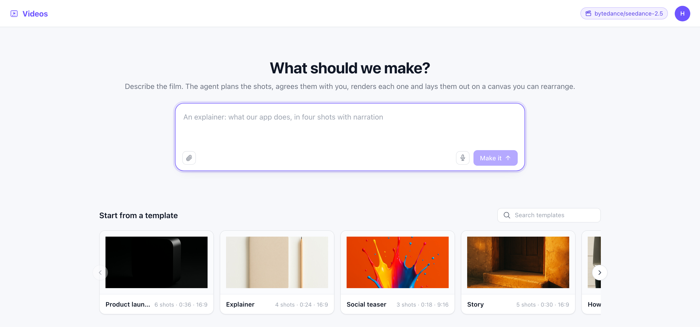

# Videos

A short film made by conversation. You say what you want to see; the agent plans the shots, writes
a prompt for each, renders them, lays them out on a canvas you can rearrange, and assembles them
into one video you can download.

Launch it from **Starter Kits** in the HarnessRouter console. That provisions the Harness this app
talks to; nothing else is deployed and nothing is configured.

## Before you launch: a provider that can generate media

This kit generates video, images and speech. It needs a media provider connected to **this
deployment**, once, by whoever runs it — not per person and not per video. After that every
Videos session uses it and nobody is asked for a key again.

The provider credential stays behind the media server the gateway hosts. It is never resolved into
a session, never written into the canvas, and never reaches the browser. What the agent is handed
for a turn is permission to ask this deployment to generate something, not a key it could take
elsewhere.

**The agent never names a model.** It asks for a *capability* — a clip from text, a clip from an
image, a still, a spoken line, music — and the gateway picks the first model in that capability's
list that is actually working, then reports which one it used. That indirection is not
architecture for its own sake: on the day this kit was built, four video models were listed and two
of them were broken. A kit that named a model would have been a kit that was down.

The consequence you will see: **a capability with no working model refuses, in plain words, and
nothing is substituted.** Speech is never offered as music. A text-only render is never quietly
sent when an image-to-video model was asked for. A watermarked model is never chosen unless a
watermark was accepted.

## What it costs, and what stops it running away

Every clip is a real charge and takes about four minutes. The kit is built around that:

- **A duration is required on every clip.** There is no default, because one model bills a
  fifteen-second clip when nothing says otherwise — roughly six times the six-second one.
- **The agent is told to agree the shot list, with a length and a price, before it spends
  anything.**
- **Stills come before clips.** A still is seconds and cents; a clip is minutes and dollars.
- **Nothing is ever re-rendered to move it.** Placing existing media on the canvas costs nothing.
- **There is a spend cap per video.** Past it the generate tools refuse and say so, rather than
  quietly throttling.
- Costs are reported only where they were actually measured. Where a provider does not report one,
  the kit shows nothing rather than an invented estimate.

## The first screen

Launch it and this is the first screen: describe the film, or start from a template. Each template
card shows a **reference frame** — a real still, generated by this product, showing the look that
template aims at. Pick one and that frame goes into your video: the opening shot is rendered from
it, so the film starts on the look you chose rather than a fresh guess at it.



From there the agent plans the shots, writes a prompt for each, submits them all at once and lays
them on the canvas as placeholders that become clips when they land — so you watch the film
arrive instead of watching a spinner.

## The timeline

The cut is a real timeline, not a list of clips in order.

- **A shot is a window onto its clip** — `[in, out]` in that clip's own seconds. Trimming moves an
  edge; splitting cuts the window in two. Neither re-renders anything, so the same six-second
  render can appear twice in a cut at two different lengths.
- **A still has no length of its own**, so the cut decides how long it is held. Drag its edge as
  far as you like — there is no file to run out of.
- **Layers ride over the cut.** Drop a clip onto the strip under the lanes and it lands at that
  second, on its own lane, drawn over the film — adding one never moves the shots underneath.
  It fills the frame or insets into a corner, and it brings its own sound.
- **Sound is placed, not queued.** A music bed starts where you put it; a voice-over sits on top
  of it at whatever level you set.
- **Nothing shows a length nobody measured.** A clip still rendering has no width on the
  timeline and the film's total reads `—` until every shot has landed.

Two shots join in one of two ways, and the difference is visible: seed each from its own still
and you get a cut; point the second at the first *clip* and it continues from the frame that clip
ended on, which is how a move carries across a join without a jump.

## How it works

- **One session is one video.** The video list is this Harness's session list, and a video's canvas
  is `scene.excalidraw` — a real Excalidraw scene, so dragging, resizing, freehand drawing and
  multi-select are Excalidraw's, not ours. Our metadata rides in each element's `customData`.
- **The agent does not write that file.** It has narrow tools — place, move, arrange, remove — and
  those produce valid scene elements. A large schema an agent writes freehand is a schema an agent
  gets wrong, so it is never given the chance.
- **Generation is submit and poll.** A generate call returns a job id immediately and the render
  runs in the background, so the agent submits every shot at once and arranges the board while they
  come in. A four-shot film is four minutes, not sixteen.
- **A job outlives the turn, and the tab.** Renders are tracked server-side and finish whether or
  not anyone is watching; the canvas updates when they land. Closing the browser does not lose a
  clip you paid for.
- **Generated media are stored once and addressed by id.** The canvas never holds a provider URL —
  every one of them expires, and the stored copy does not.
- **The app is served by the HarnessRouter image** at `/kits/video`, same-origin with the console,
  which is why it needs no API key and no login of its own.

## What's in the folder

| Path | What |
|---|---|
| `kit.json` | The Harness this kit needs, and where its app is served |
| `skills/video-storyboard/` | The loop, the storyboard format, the continuity rules, and the validator — read before anything is generated |
| `templates/templates.json` | Five worked storyboards (product launch, explainer, teaser, story, how-to) as reference material |
| `app/` | The UI |

## The document

`scene.excalidraw` is the whole video: a standard Excalidraw scene — `elements`, `appState`,
`files` — plus one extra top-level key, `timeline`, holding the cut. Excalidraw's own loader reads
only the first three and ignores the rest, so the file opens unchanged in any Excalidraw (without
the timeline, which is honest: the canvas is the part that is theirs).

Two rules about that file are worth stating outright because both fail silently:

- **The canvas is not something the agent edits as a file.** It changes through the canvas tools
  and nothing else. Writing to `scene.excalidraw` from inside a turn changes nothing anyone sees.
- **The order of `timeline.shots` is the cut order.** It is never inferred from where cards sit on
  the canvas, or dragging one to tidy the board would silently re-cut the film.

The contract is stated once, in `skills/video-storyboard/SKILL.md`, and enforced twice — by the app
and the export pipeline, and by `validate_scene.py`, which the agent runs before it finishes. If
the two ever disagree, the running system is right and the validator is the bug.

```
python3 skills/video-storyboard/validate_scene.py path/to/scene.excalidraw --expect-seconds 36
python3 skills/video-storyboard/validate_scene.py --templates templates/templates.json
```

It catches what cannot be seen from inside a turn: a timeline shot that is still rendering, a shot
pointing at an element that is not on the board, a trim past the end of a clip, media stacked on
media, a provider URL written into the document, an `appState.collaborators` map that survived a
JSON round trip and will white-screen the canvas, and a total length that does not match the
storyboard the person agreed to. It cannot ask whether a job id is real, and hosted it may be
reading a scene one turn old — the agent is told both.

The `--templates` form runs over every template's scene, so the examples the agent copies from
cannot quietly drift out of the contract.

## Export

Assembly is local: the shots are trimmed, normalised to the timeline's declared resolution —
**letterboxed, never stretched** — concatenated, mixed with any audio, and written out as one MP4.
It then measures its own output and fails if the assembled duration disagrees with the plan by more
than half a second, naming both numbers.

This needs `ffmpeg` and `ffprobe` in the image. Where they are absent, the capability reports
itself unavailable, the export refuses with that sentence, and the app's Export button is disabled
with the same one beneath it. The clips are all still downloadable individually. There is no
partial file and no silent degradation.

## Working on the app

```
cd app
npm install
npm test
npm run build
```

## License

This kit is governed by the [HarnessRouter Starter Kit License Agreement](../LICENSE.md), not MIT.

- Individual local use is free under that Agreement.
- Selling, deploying, hosting or providing an End Product to an external customer, and creating
  paid Client Deliverables, require the
  [Commercial Use and Deployment Agreement](../COMMERCIAL-DEPLOYMENT-AGREEMENT.md) and an
  [Order Form](../ORDER-FORM-TEMPLATE.md).

Third-party materials keep their own licenses — see [CREDITS.md](./CREDITS.md).
