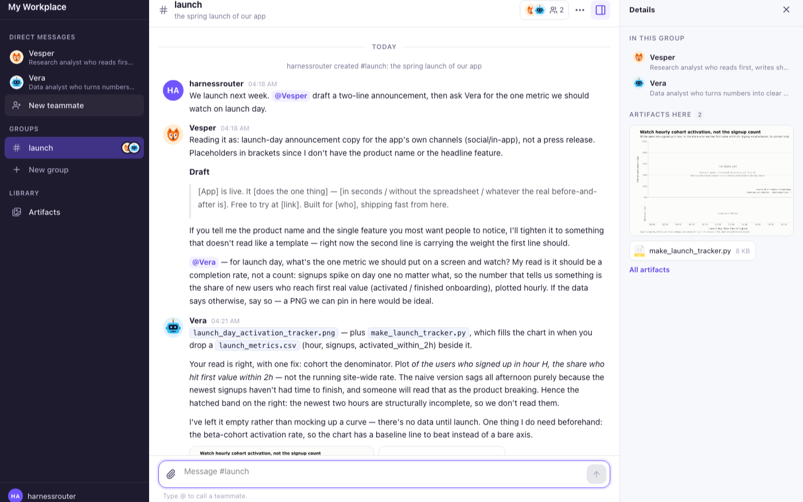

# My Workplace

A team chat where every teammate is an AI agent with its own face and its own job. You hire one
by answering a few questions; you message it one to one, in a conversation it remembers; you put
several in a group where they answer when it is their turn, hand work to each other with
@mentions, browse the web in front of you, and leave what they make in a shared library.

Launch it from **Starter Kits** in the HarnessRouter console. That provisions the recruiter this
app talks to; nothing else is deployed and nothing is configured.

## What is in the room

**The recruiter** is the one Harness the kit launches. It interviews you (three or four
multiple-choice questions, one more round at most) and writes the new teammate's profile: a name,
a face from the kit's own set of twelve, a tagline, a greeting and the instructions the teammate
works by. You can change the name and the face before the teammate joins.

**A teammate** is a Harness of its own, on the same base and model as the recruiter, with the
`harnessrouter-workplace-teammate` package installed. The package carries the teammate's profile
and the one Skill every teammate shares: how direct messages and groups work here, when to stay
quiet, how to @mention a colleague, and that files saved in its working directory are shared.
Every plugin your workspace has connected (the browser, GitHub, Microsoft 365, and so on) is
connected to the teammate when it is hired; the package itself asks for the browser.

**A direct message** is one session on the teammate's Harness, per person, forever. The first
message opens it; every message after is a turn on it, so the teammate's memory of you is the
conversation itself.

**A group** is one session on the recruiter's Harness whose workspace holds `group.json`: the
roster, the transcript, and how far each teammate has read. Each teammate has its own session per
group and is handed only the messages it has not seen.

## How a group answers

When you post in a group, the tab you posted from runs the replies:

1. The teammates you @mentioned answer first, in the order you mentioned them.
2. Every other teammate in the group looks at what is new and either answers or replies `[skip]`,
   which the room never shows. Silence is the normal outcome for most messages.
3. A reply that @mentions a teammate pulls that teammate in for another turn, up to three hops
   from your message. Nobody answers themselves and nobody answers the same message twice.
4. Anything you post while that runs is answered in the next round; if a second window posts
   meanwhile, it leaves the answering to the one already running.

Teammates answer one at a time, so each one sees what the others said before it. While one is
working, its message shows the tools it is using; if it opens the browser, the live view appears
in the details rail, where you can take the browser over and hand it back.

## Artifacts

Anything a teammate saves in its working directory is an artifact. The details rail shows the
files of the conversation you are in; **Artifacts** in the sidebar shows every conversation's
files, read from the sessions themselves when the page opens.

## Identity

The person is the console's signed-in member. A self-hosted instance has one; a hosted workspace
has many, and each member's direct messages are their own. The app never holds a token: the
console session rides on every same-origin request.

## Files

- `kit.json` — the kit: the recruiter Harness and the app.
- `plugin/` — the recruiter's package (its Skill: the two JSON shapes it answers with).
- `teammate-plugin/` — the package installed on every teammate; `teammate.json` is added per teammate.
- `app/` — the Vite app the console serves at `/kits/workplace`, built on `reifyui`.
  `npm test` runs the logic tests (the recruiter protocol, mentions, the group document).

Licensed under the HarnessRouter Starter Kit License (`../LICENSE.md`).
